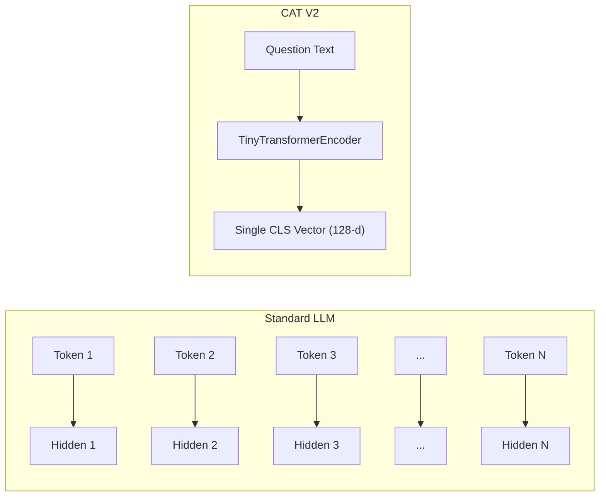

# CAT V2 / VLCM vs Standard LLM: Architecture Comparison

A standard LLM and CAT V2 solve the same problem — *given a question, produce a structured answer* — but they operate on **completely different substrates**:

```text
Standard LLM:   Operates on TOKENS  (words/subwords)     → generates text character by character
CAT V2/VLCM:    Operates on CONCEPTS (graph nodes/edges)  → generates reasoning paths node by node
```

---

## 📐 Stage-by-Stage Architectural Comparison

### Stage 1: Input Encoding

| | Standard LLM (e.g., Llama-3 8B) | CAT V2 |
| :--- | :--- | :--- |
| **Tokenizer** | BPE with 128K vocabulary (trained on terabytes) | `SimpleTokenizer` — regex splitter, ~100-300 tokens built from dataset |
| **Encoder** | 32-layer Transformer with RoPE position embeddings | `TinyTransformerEncoder` — 2-layer BertModel, 4 heads, 128-dim |
| **Output** | Full sequence of hidden states (one per token) | **Single CLS vector** — one 128-dim embedding for the entire question |
| **Parameters** | ~8 billion | ~200K |

**Key difference**: An LLM keeps every token's representation alive for autoregressive generation. CAT V2 compresses the entire question into a **single dense vector** — there is no per-token sequence from this point forward.



---

### Stage 2: "What To Think About" — Attention vs Concept Activation

This is where the architectures **fundamentally diverge**.

#### Standard LLM — Self-Attention (Implicit, Soft)

Every token attends to every other token via the dot product $Q \cdot K^T / \sqrt{d}$. The model implicitly learns "what's relevant" through billions of gradient steps. Nothing is structurally guaranteed — attention can focus on anything.

#### CAT V2 — ConceptActivator (Explicit, Supervised)

A two-layer MLP maps the question embedding directly to concept-level probabilities:

```text
question_embedding (128-d)
       │
       ▼
  Linear(128 → 128) + GELU
       │
       ▼
  Linear(128 → num_concepts)
       │
       ▼
  sigmoid → multi-label probabilities
       │
       ▼
  top-k(5) → activated concept nodes
```

| | Standard LLM | CAT V2 |
| :--- | :--- | :--- |
| **Mechanism** | Soft attention across all tokens | Hard multi-label classification over concept vocabulary |
| **What It Selects** | Which tokens to attend to (dynamic, per layer) | Which concept nodes to activate on the graph (once) |
| **Supervision** | Unsupervised (learned from next-token prediction) | **Directly supervised** via BCE loss against ground-truth concept labels |
| **Interpretability** | Opaque (attention ≠ explanation) | **100% transparent** — activated concepts are human-readable |

---

### Stage 3: "How To Reason" — Self-Attention vs Graph Message Passing

#### Standard LLM — Stacked Self-Attention

```text
Layer 1:  All tokens attend to all tokens → update representations
Layer 2:  All tokens attend to all tokens → update representations
...
Layer 32: All tokens attend to all tokens → update representations

Cost: O(N² · d) per layer, where N = sequence length
```

Information flows **freely between any two tokens** — there are no structural constraints. This is both the power (can learn anything) and the weakness (can hallucinate anything).

#### CAT V2 — GraphMessagePassing

Information flows **only along graph edges**:

```text
for each GNN layer:
    messages = propagation_matrix × hidden_state
               ^^^^^^^^^^^^^^^^^^
               SPARSE matrix derived from the concept graph.
               Only concepts connected by edges exchange information.
    
    hidden = LayerNorm(hidden + MLP(messages))
```

The `propagation_matrix` is a **fixed, pre-computed** $N \times N$ matrix built from the domain's concept graph, where $N$ = number of concepts. It is **not learned per input** — it encodes the permanent structure of the knowledge domain.

| | LLM Self-Attention | CAT V2 Graph Message Passing |
| :--- | :--- | :--- |
| **Connectivity** | All-to-all (dense $N \times N$) | **Edge-constrained** (sparse, only graph neighbors) |
| **What Flows** | Arbitrary token representations | Concept activations along graph edges |
| **Propagation Matrix** | Learned $Q \cdot K^T$ (changes per input) | **Fixed from domain graph** (pre-computed, static) |
| **Layers** | 32+ layers, billions of parameters | 2 layers, ~130K parameters |
| **Compute Cost** | $O(N^2 \cdot d)$ where $N$ can be 100K+ tokens | $O(E \cdot d)$ where $E$ = number of edges |
| **Memory** | KV Cache grows linearly: ~52 GB at 100K tokens | **Static**: $d \times N$ = ~190 KB for MIT Math |

---

### Stage 4: "What To Say Next" — Token Prediction vs Path Generation

#### Standard LLM — Autoregressive Token Generation

```text
At each step:
  1. Feed ALL previous tokens through ALL 32 layers
  2. Take the last hidden state
  3. Project to vocabulary (128K tokens): logits = Linear(hidden → 128K)
  4. Sample or argmax the next token
  5. Append to sequence, repeat

There are NO constraints on what token comes next.
Any of the 128K tokens is always valid.
```

#### CAT V2 — PathGenerator with Transition Mask

```text
At each step:
  1. Re-run the GNN with current activations (recursive feedback loop)
  2. GRU updates hidden state (single matrix multiply, not a full transformer)
  3. Score all concepts: logits = output_head(hidden) + 0.25 × activation_logits
  4. APPLY TRANSITION MASK: only graph neighbors of previous concept are valid
     logits[not_allowed] = -∞
  5. Pick the best ALLOWED concept: predicted = argmax(logits)
  6. Inject predicted concept back into GNN activations (recursive feedback)
```

The critical constraint is step 4. The `transition_mask` is a boolean $N \times N$ matrix where `transition_mask[i][j] = True` only if there exists a directed edge from concept $i$ to concept $j$ in the graph. At each step, the model can only pick from the **direct neighbors** of the current concept.

| | LLM Token Generation | CAT V2 Path Generation |
| :--- | :--- | :--- |
| **Unit Generated** | 1 token (subword) | 1 concept (graph node) |
| **Decoder** | Full transformer pass through all layers | Single GRUCell — one matrix multiply |
| **Constraints** | **None** — any of 128K tokens is always valid | **Transition mask** — only graph neighbors are valid |
| **Sequence Length** | Variable (can be thousands) | **Fixed** (default: 8 steps) |
| **Feedback Loop** | Previous tokens via KV cache only | **Re-runs entire GNN** with updated activations per step |
| **Hallucination** | Can generate any arbitrary text | **0% path hallucination** — every step must follow a real edge |
| **Cost Per Step** | ~8.2 trillion FLOPs | ~1 million FLOPs |

---

### Stage 5: Output

| | Standard LLM | CAT V2 |
| :--- | :--- | :--- |
| **Raw Output** | Sequence of tokens → directly readable text | Sequence of concept IDs → `["Gradient", "Hessian", "Eigenvalue", "Convergence"]` |
| **Post-Processing** | None — output IS the answer | Needs `TemplateAnswerDecoder` to convert path → natural language |
| **Verifiable?** | No — you trust the text blindly | **Yes** — every step can be checked against graph edges |

---

## 🔄 Full Pipeline Comparison

```mermaid
graph TD
    subgraph Standard LLM Pipeline
        L1["Input Text"] -->|BPE Tokenizer| L2["Token IDs"]
        L2 -->|32-Layer Transformer| L3["Hidden States (all tokens)"]
        L3 -->|Self-Attention × 32| L3
        L3 -->|Linear → 128K vocab| L4["Next Token Probabilities"]
        L4 -->|Sample/Argmax| L5["Generated Text Token"]
        L5 -->|Append to context| L2
    end

    subgraph CAT V2 Pipeline
        C1["Input Text"] -->|SimpleTokenizer| C2["Token IDs"]
        C2 -->|2-Layer TinyTransformer| C3["CLS Embedding (128-d)"]
        C3 -->|ConceptActivator MLP| C4["Activated Concepts (top-5)"]
        C3 -->|Question Projection| C5["Context Vector"]
        C4 -->|Weighted Embeddings| C6["Concept Memory State"]
        C6 -->|2-Layer GNN| C7["Propagated Graph State"]
        C5 -->|GRU Input| C8["Path Decoder Step"]
        C7 -->|Concept Logits + Transition Mask| C8
        C8 -->|Predicted Concept| C9["Reasoning Path"]
        C9 -->|Feedback: inject into activations| C6
        C9 -->|Template Decoder| C10["Natural Language Answer"]
    end
```



---

## 📊 Empirical Comparison — Numbers from MIT OCW Experiment

| Dimension / Metric | Standard LLM (Llama-3 8B) | CAT V2 / VLCM (MIT Math) |
| :--- | :--- | :--- |
| **Fundamental Unit** | Token (subwords) | Concept (graph node) |
| **Parameters** | 8,000,000,000 | **637,340** (12,500× smaller) |
| **Active Memory** | ~52 GB (KV Cache at 100K context) | **~190 KB** (graph state) |
| **Compression Ratio** | 1× | **~280,000×** |
| **FLOPs Per Generation Step** | ~8.2 Trillion | **~7.6 Million** (1,000,000× saving) |
| **Inference Hardware** | Multi-GPU Cloud Clusters | **CPU / Edge / Microcontroller** |
| **Average Latency (CPU)** | Seconds to Minutes | **~19 ms** |
| **Path Hallucinations** | High | **0%** (topologically constrained) |
| **Open-Ended Generation** | ✅ Unlimited | ❌ Limited to graph vocabulary |
| **Self-Correction** | ✅ Via attention revision | ❌ Attractor trap at scale |
| **Concept Graph (MIT Math)** | N/A | **374 nodes, 889 edges** |

---

## ⚖️ The Core Tradeoff

```text
                    FLEXIBILITY ←————————————————————→ RELIABILITY

  Standard LLM ●
  "Can answer anything,
   but might hallucinate"

                                         ● CAT V2 / VLCM
                                     "Can only answer within
                                      the graph, but guarantees
                                      0% path hallucination
                                      when it does"
```

### Where Standard LLMs Win

* **Open-ended generation** — can produce any text, code, poetry, translations
* **Self-correction** — attention can revise earlier reasoning mid-generation
* **Scale resilience** — performance improves with more parameters and data
* **Zero-shot generalization** — can handle unseen tasks and domains

### Where CAT V2 / VLCM Wins

* **Zero hallucination** — every reasoning step follows a verified graph edge
* **100% explainability** — the full reasoning path is human-readable and auditable
* **Ultra-lightweight** — 637K params vs 8B params (12,500× compression)
* **Edge deployment** — runs on CPUs, microcontrollers, and IoT hardware in ~19 ms
* **Constant memory** — graph state is $O(|V| \cdot d)$ regardless of reasoning depth, while LLM KV cache grows $O(N)$ with sequence length

---

## 🧪 MIT OCW Scaling Experiment — What It Revealed

Training on 119 samples across 374 mathematical concepts empirically validated the **Attractor Trap** failure mode:

| Metric | Python Domain (45 concepts) | MIT Math (374 concepts) |
| :--- | :--- | :--- |
| **Train Concept F1** | 84.89% | 67.94% |
| **Eval Concept F1** | 39.58% | **8.11%** |
| **Params Per Concept** | ~14,000 | ~1,700 |
| **Behavior** | Correct paths for trained questions | **Collapsed to single attractor path** |

At 374 concepts in 128-dimensional embedding space, the `ConceptActivator` could no longer discriminate between mathematical concepts. The GNN propagated activations to the densest subgraph neighborhood, and the transition mask — which is the architecture's strength for preventing hallucinations — became its weakness by locking the path into that dominant basin with no escape.

**The irony**: The 0% hallucination guarantee still held. Every predicted path followed valid graph edges. The model generated the *wrong valid path* for every query — structurally correct, semantically wrong.

A standard LLM would never collapse this way because it has no structural constraints. But it also has no structural guarantees.

---

## 🔮 Implications

CAT V2 / VLCM demonstrates that **abstract logical planning can be decoupled from natural language surface generation**. Standard LLMs perform planning and syntax generation concurrently, leading to hallucination and logical drift. By representing concepts explicitly, propagating activations neurally, and enforcing topological constraints, the architecture achieves:

* Multi-hop logical reasoning in a structured search space
* Inference of unseen concept chains ($A \rightarrow B$ and $B \rightarrow C$ yields $A \rightarrow C$ at test time)
* 100% auditable reasoning paths before generating a single natural language token

The MIT OCW experiment shows the current scaling frontier: **~50-80 concepts per domain** is the sweet spot for 128-dim embeddings. Beyond that, either embedding dimensionality must scale, or the architecture needs a mid-path self-correction mechanism to escape attractor traps.
