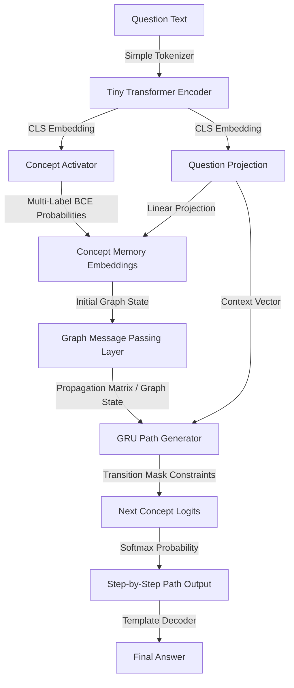

# CAT V2: Concept Attention Transformer

CAT V2 is an advanced research prototype for **explicit concept reasoning**. Unlike traditional language models that generate free-form text token-by-token, CAT V2 activates concept nodes on a structured graph and performs neural message passing to generate valid, verifiable reasoning paths.

```text
Traditional LLM:  Question ➔ Tokens ➔ Attention ➔ Tokens ➔ Answer
CAT V2:           Question ➔ Concept Activations ➔ Concept Graph ➔ Reasoning Path ➔ Answer
```

---

## 🚀 Key Features

* **Strict Graph Constraint**: Uses a transition mask built from the concept graph to restrict path generation at each step. Hallucination rate on logical path transitions is **0%**.
* **Domain Checkpoints**: Includes pre-trained checkpoints for **CFD (Computational Fluid Dynamics)** and **Structural Engineering** concepts.
* **Interactive Lab GUI**: A built-in web interface to inspect the next-concept predictions step-by-step, mimicking next-token probability visualization in transformers.
* **Pure PyTorch Message Passing**: Graph edges propagate activations neurally before decoding paths.

---

## 🏛️ Architecture Flow



---

## 🖥️ Interactive Lab GUI

The project features a beautiful, responsive dark-mode GUI to test step-by-step next-concept predictions. It displays the allowed transition nodes along with their probabilities, enabling manual traversal or automated completion.

### Running the GUI:
```powershell
.\.venv\Scripts\python.exe gui_server.py
```
After starting the server, open your browser and navigate to:
👉 **[http://localhost:8080/](http://localhost:8080/)**

### GUI Capabilities:
* **Checkpoint Switcher**: Dynamic loading of `Structural Engineering` or `CFD` models.
* **Probabilistic Path Builder**: Shows all mathematically valid next concepts along with active probability bars.
* **Auto-Complete**: Leverages the GRU path generator to complete the remaining path autoregressively.
* **Interactive Graph**: Displays nodes and edges with real-time highlights showing the selected reasoning path.

---

## 📊 Comparison & Benchmarks

Here is how the CAT V2 Concept SLM compares against standard text-generation models:

| Feature / Metric | CAT V2 (Concept SLM) | Standard SLM (e.g., GPT-2 124M) | Commercial LLM (e.g., GPT-4o) |
| :--- | :--- | :--- | :--- |
| **Parameters** | **~638K** (Ultra-lightweight) | **124M** | **Billions** |
| **Reasoning Constraint** | Strict path traversal on concept graph | Free-form tokens | Free-form tokens |
| **Path Hallucinations** | **0%** (Strict transition mask) | High (frequently invalid paths) | Medium-High (unpredictable logic leaps) |
| **Interpretability** | **100% Transparent** (Path weights visible) | Black-box attention maps | Completely opaque |
| **Training Data Size** | `<100` domain examples | Millions of tokens | Billions/Trillions of tokens |
| **Inference Hardware** | CPU (runs in milliseconds) | Small GPU / High-end CPU | Multi-GPU Cloud Clusters |

---

## 🛠️ CLI Quick Start

### 1. Verification & Tests
Ensure the environment is configured correctly:
```powershell
.\.venv\Scripts\python.exe -m unittest discover -s tests
```

### 2. Training the Model
Train the model on the structural dataset (or specify another path using `--dataset`):
```powershell
# Train Structural Reasoning (30 Epochs)
.\.venv\Scripts\python.exe run_reasoning.py train --dataset data/structural_reasoning_dataset.json --checkpoint-dir checkpoints/cat_v2_structural --epochs 30

# Train CFD Reasoning (3 Epochs)
.\.venv\Scripts\python.exe run_reasoning.py train --dataset data/reasoning_dataset.json --checkpoint-dir checkpoints/cat_v2 --epochs 3
```

### 3. Path Inference
Query the model to generate a path:
```powershell
.\.venv\Scripts\python.exe run_reasoning.py infer --dataset data/structural_reasoning_dataset.json --checkpoint-dir checkpoints/cat_v2_structural --question "How does load cause structural failure?"
```

### 4. Visualizing Graphs Offline
Save static PNG representations of the reasoning graphs:
```powershell
.\.venv\Scripts\python.exe run_reasoning.py visualize --dataset data/structural_reasoning_dataset.json --checkpoint-dir checkpoints/cat_v2_structural --output reports/cat_v2_structural_graph.png
```

---

## 📂 Core Source Files

* [cat_reasoning_model.py](file:///c:/Users/user/Downloads/build/cat_reasoning_model.py): Core neural model (encoder, memory, activator, GMP, path generator).
* [reasoning_graph.py](file:///c:/Users/user/Downloads/build/reasoning_graph.py): Explicit node/edge attributes, beam search, and matplotlib layout logic.
* [reasoning_dataset.py](file:///c:/Users/user/Downloads/build/reasoning_dataset.py): Dataset loaders, vocabulary builders, and tokenizer logic.
* [reasoning_loss.py](file:///c:/Users/user/Downloads/build/reasoning_loss.py): Supervised loss components (Path CE, BCE activation, metrics).
* [reasoning_trainer.py](file:///c:/Users/user/Downloads/build/reasoning_trainer.py): Training loops, evaluation, and checkpoint sorting utilities.
* [gui_server.py](file:///c:/Users/user/Downloads/build/gui_server.py): HTTP API server and frontend files.
