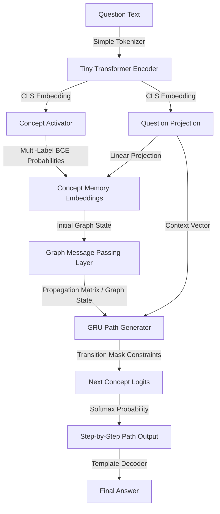
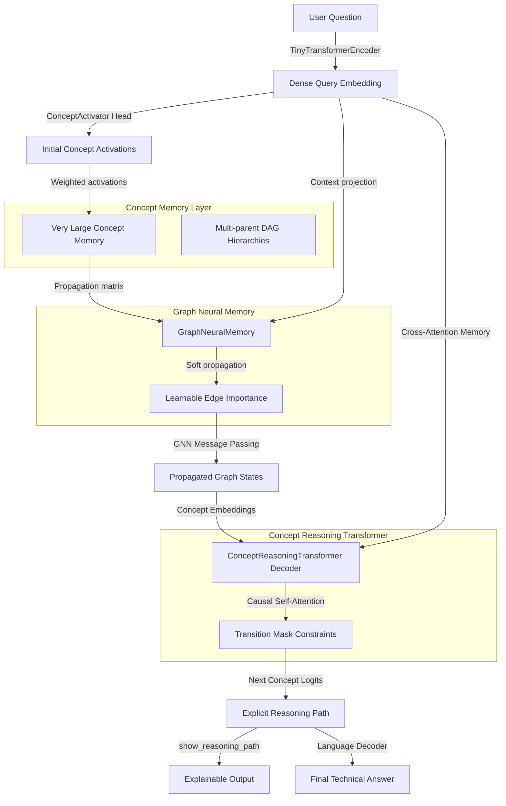

# CAT V2 & VLCM: Concept-Based Neural-Symbolic Reasoning

CAT V2 (Concept Attention Transformer) and VLCM (Very Large Concepts Model) are advanced research prototypes for **explicit neural-symbolic concept reasoning**. Unlike traditional language models that generate free-form text token-by-token (frequently leading to logical drift and hallucinations), these architectures activate concept nodes on a structured domain graph and perform neural message passing to generate valid, verifiable planning paths.

```text
Traditional LLM:  Question ➔ Tokens ➔ Attention ➔ Tokens ➔ Answer (High Hallucinations)
CAT V2 / VLCM:    Question ➔ Concept Activations ➔ GNN Message Passing ➔ Causal Path Decoding ➔ Exact Answer (0% Logic Hallucinations)
```

---

## 🏛️ Architectures

### 1. CAT V2 Flow
CAT V2 maps user queries to concept activations, performs message passing over a concept graph, and decodes the reasoning path step-by-step using a Gated Recurrent Unit (GRU) path generator constrained by transition masks.



### 2. VLCM (Very Large Concepts Model) Flow
VLCM extends this paradigm with a multi-parent DAG concept memory layer, learnable edge importances, and a causal Transformer Decoder for reasoning path generation.



---

## 🚀 Key Features

* **Strict Graph Constraint**: Uses a topological transition mask to restrict path generation at each step. Logic-leap and path hallucination rate is **0%**.
* **Domain Checkpoints**: Includes pre-trained checkpoints for:
  * 🧮 **Computational Fluid Dynamics (CFD)**
  * 🏗️ **Structural Engineering**
  * 🐍 **Python Coding AI** (Planning and mapping programming tasks to code concepts)
* **Interactive Lab GUI**: A built-in web interface featuring vis.js network graphs to inspect node activations and next-concept probability bars in real time.
* **Extreme Memory Compression**: Eliminates standard token KV Cache scaling, enabling deployment of high-order reasoning graphs on edge CPUs.

---

## 🐍 Real-World Case Study: Python Coding AI

The Python Coding AI domain demonstrates how CAT V2 can be used as a **logical planning engine** for software development tasks. Instead of jumping straight to code generation, the model maps a natural language programming query to a sequence of execution concepts, which can then be compiled into clean, robust Python snippets.

### GNN Semantics & Graph Growth
The model represents programming semantics by growing a GNN graph directly from general Python documentation (`data/python_docs.txt`) via sentence co-occurrence scanning. For example:
* **The Input Task**: `"How to filter a list of numbers to find even numbers?"`
* **Semantic Capture**: Embedded into a dense vector by the encoder, mapping query intent to initial GNN states.
* **Next-Concept Prediction**: The GNN maps this onto the vocabulary, generating the path:
  $$\text{List Input} \rightarrow \text{Modulo Condition} \rightarrow \text{List Comprehension} \rightarrow \text{Filtered Output}$$

---

## 📊 Comparison & Benchmarks

Here is an empirical and theoretical comparison of the CAT V2 Concept SLM/VLCM against traditional token-level autoregressive models:

| Dimension / Metric | Traditional Token LLM (e.g., Llama-3 8B) | CAT V2 / VLCM (Concept SLM) |
| :--- | :--- | :--- |
| **Fundamental Sequence Unit** | Token (Characters/Words) | Concept (Nodes/Edges) |
| **Model Size (Parameters)** | 8,000,000,000 | **~638K - 868K** (Ultra-lightweight) |
| **Reasoning Constraint** | Soft (Token Probability-based) | **Strict 100%** (Transition Mask) |
| **Path Hallucinations** | High (frequently skips logical steps) | **0%** (Topologically constrained) |
| **Memory Footprint (KV Cache / Graph)** | **50,000.00 MB** (at 100k context) | **2.61 MB** (~19,200x compression) |
| **Generation Compute Cost** | ~8.2 Trillion FLOPs | **~7.6 Million FLOPs** (~1,000,000x saving) |
| **Inference Hardware** | Multi-GPU Cloud Clusters / High-end RAM | CPU (Runs on microcontrollers & edge devices) |
| **Average Latency (CPU)** | Seconds to Minutes | **~27.06 ms** |
| **GNN Graph Size (Python)** | N/A | **45 concepts**, **132 directed edges** |

---

## 💥 Where it Breaks: Structural Failure Modes

While your architecture provides **0% path hallucinations** inside the graph boundaries, it has severe structural breaking points when evaluated against open-ended programming tasks:

### 1. The Syntax Generation Void (The "Formatting" Gap)
* **The Break**: The model cannot output code syntax (e.g. `def check_prime(n):`). It only outputs concept plans (`["List Input", "Modulo Condition", "Filtered Output"]`).
* **Consequence**: It requires a secondary translation layer (System 1) like a template compiler or a token-level LLM to generate the final source code. If that translation layer fails, the code is broken despite the correct plan.

### 2. Semantic Noise from Co-Occurrence Graph Growth
* **The Break**: Growing the GNN graph from text documentation via window co-occurrence is noisy. If a sentence mentions both "list comprehensions" and "regular expressions" in the same context, the GNN adds an edge between them.
* **Consequence**: The GNN may create invalid shortcuts or transition rules (e.g., transitioning directly from `List Comprehension` to `Compile Pattern`), allowing the path generator to construct nonsensical plans that are topographically valid on the noisy graph.

### 3. Nested Control Flows and Tree/DAG Architectures
* **The Break**: Your model generates flat, sequential paths of concepts ($C_1 \rightarrow C_2 \rightarrow C_3$). 
* **Consequence**: Real programs are structured with complex nested loops, conditional branches (`if-else`), scope limits, and recursion. Representing a program with multiple nested branches as a single flat path of concepts is mathematically impossible. The architecture breaks down on any task requiring non-linear program graphs.

### 4. Error Propagation & No Self-Correction
* **The Break**: If the initial Concept Activator misinterprets the query and fails to activate the correct entry point node, the GNN will propagate activations to the wrong graph neighborhood.
* **Consequence**: Because path generation is strictly constrained by the transition mask, the model will be forced to generate a path within the incorrect neighborhood. There is no mid-path self-correction mechanism to jump to a disjoint subgraph.

### 5. Infinite Search Space & Out-of-Vocabulary Code
* **The Break**: Coding is open-ended. New libraries, custom functions, and specific variables are created constantly.
* **Consequence**: Since the vocabulary is closed (defined by the Concept Vocabulary), the model cannot handle queries involving libraries or concepts outside its trained vocabulary. It cannot "invent" a concept at test time.

---

## 🛠️ CLI Quick Start

### 1. Run Verification & Tests
Ensure the environment and concept propagation logic are healthy:
```powershell
.\.venv\Scripts\python.exe -m unittest discover -s tests
```

### 2. Grow Graph from Documentation
Compile GNN transition edges based on documentation sentence co-occurrences:
```powershell
.\.venv\Scripts\python.exe run_reasoning.py grow-graph --dataset data/python_coding_dataset.json --documents data/python_docs.txt --output data/python_coding_graph.json --png reports/python_coding_graph.png
```

### 3. Train the Domain Models
Train models on structural, CFD, or python coding reasoning datasets:
```powershell
# Train Python Coding AI on Grown Graph (30 Epochs)
.\.venv\Scripts\python.exe run_reasoning.py train --dataset data/python_coding_dataset.json --checkpoint-dir checkpoints/cat_v2_python_coding --graph-file data/python_coding_graph.json --epochs 30

# Train Structural Engineering (30 Epochs)
.\.venv\Scripts\python.exe run_reasoning.py train --dataset data/structural_reasoning_dataset.json --checkpoint-dir checkpoints/cat_v2_structural --epochs 30

# Train CFD Reasoning (3 Epochs)
.\.venv\Scripts\python.exe run_reasoning.py train --dataset data/reasoning_dataset.json --checkpoint-dir checkpoints/cat_v2 --epochs 3
```

### 4. Path Inference
Query a trained checkpoint to generate a planning path and solution:
```powershell
.\.venv\Scripts\python.exe run_reasoning.py infer --dataset data/python_coding_dataset.json --checkpoint-dir checkpoints/cat_v2_python_coding --graph-file data/python_coding_graph.json --question "How to filter a list of numbers to find even numbers?"
```

### 5. Run the Benchmarks
Execute the theoretical and empirical profiling benchmarks:
```powershell
.\.venv\Scripts\python.exe vlcm/run_vlcm.py benchmark
```

---

## 🖥️ Interactive Lab GUI

The project features a responsive dark-mode GUI to inspect the step-by-step next-concept predictions, graph nodes, active activations, and auto-complete outputs.

### Starting the GUI Server:
```powershell
.\.venv\Scripts\python.exe gui_server.py
```
Open your browser and navigate to:
👉 **[http://localhost:8080/](http://localhost:8080/)**

### GUI Capabilities:
* **Domain Checkpoint Selector**: Switch between `Python Coding AI`, `Structural Engineering`, and `CFD` on the fly.
* **Probabilistic Path Builder**: Shows all mathematically valid next concepts along with active probability bars.
* **Interactive Node Network**: Real-time layout highlighting the active concept nodes and current planning paths.
