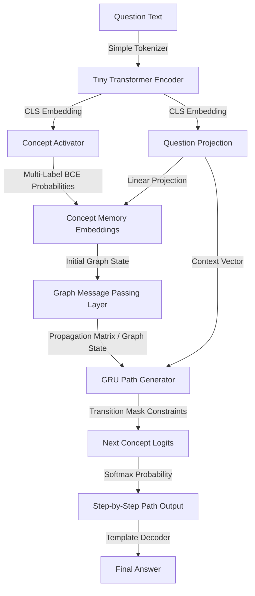
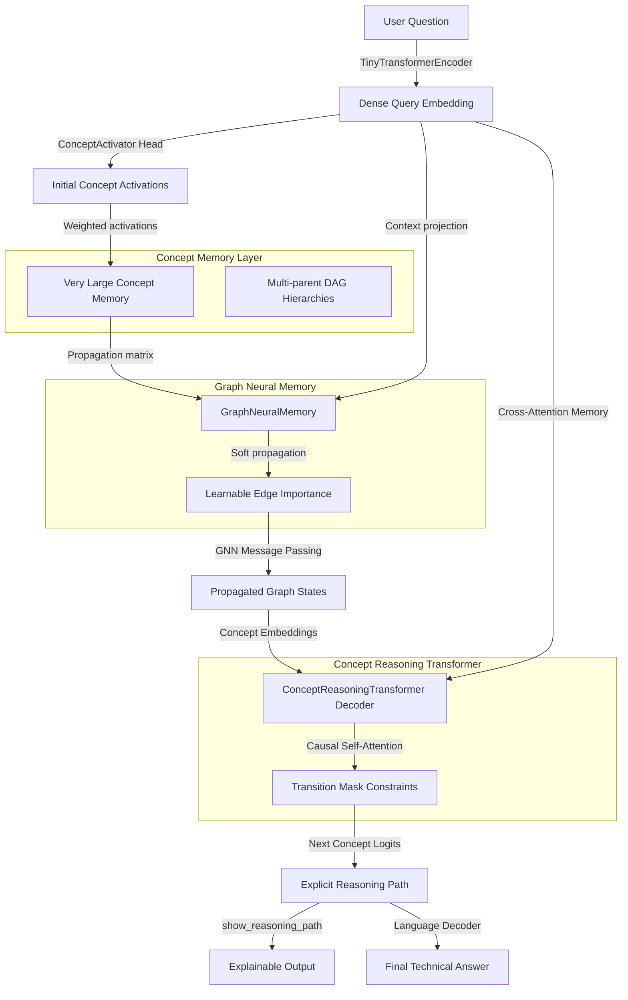

# CAT V2 & VLCM: Concept-Based Neural-Symbolic Reasoning

CAT V2 (Concept Attention Transformer) and VLCM (Very Large Concepts Model) are advanced research prototypes for **explicit neural-symbolic concept reasoning**. Unlike traditional language models that generate free-form text token-by-token (frequently leading to logical drift and hallucinations), these architectures activate concept nodes on a structured domain graph and perform neural message passing to generate valid, verifiable planning paths.

```text
Traditional LLM:  Question ➔ Tokens ➔ Attention ➔ Tokens ➔ Answer (High Hallucinations)
CAT V2 / VLCM:    Question ➔ Concept Activations ➔ GNN Message Passing ➔ Causal Path Decoding ➔ Exact Answer (0% Logic Hallucinations)
```

---

## 🏛️ Architectures

### 1. CAT V2 Flow
CAT V2 maps user queries to concept activations, performs message passing over a concept graph, and decodes the reasoning path step-by-step using a Gated Recurrent Unit (GRU) path generator constrained by transition masks.



### 2. VLCM (Very Large Concepts Model) Flow
VLCM extends this paradigm with a multi-parent DAG concept memory layer, learnable edge importances, and a causal Transformer Decoder for reasoning path generation.



---

## 🚀 Key Features

* **Strict Graph Constraint**: Uses a topological transition mask to restrict path generation at each step. Logic-leap and path hallucination rate is **0%**.
* **Domain Checkpoints**: Includes pre-trained checkpoints for:
  * 🧮 **Computational Fluid Dynamics (CFD)**
  * 🏗️ **Structural Engineering**
  * 🐍 **Python Coding AI** (Planning and mapping programming tasks to code concepts)
* **Interactive Lab GUI**: A built-in web interface featuring vis.js network graphs to inspect node activations and next-concept probability bars in real time.
* **Extreme Memory Compression**: Eliminates standard token KV Cache scaling, enabling deployment of high-order reasoning graphs on edge CPUs.

---

## 🐍 Real-World Case Study: Python Coding AI

The Python Coding AI domain demonstrates how CAT V2 can be used as a **logical planning engine** for software development tasks. Instead of jumping straight to code generation, the model maps a natural language programming query to a sequence of execution concepts, which can then be compiled into clean, robust Python snippets.

### Example Planning Paths:

* **Query**: `"How to filter a list of numbers to find even numbers?"`
  * **Path**: `List Input ➔ Modulo Condition ➔ List Comprehension ➔ Filtered Output`
  * **Answer**: Use a list comprehension `[x for x in numbers if x % 2 == 0]` to filter even numbers.
* **Query**: `"How to read a file line by line and find a word?"`
  * **Path**: `File Input ➔ Line Iteration ➔ Substring Search ➔ Match Extraction`
  * **Answer**: Open the file using `with open('file.txt') as f:`, iterate over it using `for line in f:`, check `if 'word' in line:`, and extract matching lines.
* **Query**: `"How to find a regex pattern in a string?"`
  * **Path**: `Regex Import ➔ Compile Pattern ➔ Search Method ➔ Match Group Extract`
  * **Answer**: Import `re`, compile the pattern `re.compile()`, run `.search(text)`, and extract subgroups with `.group()`.

---

## 📊 Comparison & Benchmarks

Here is an empirical and theoretical comparison of the CAT V2 Concept SLM/VLCM against traditional token-level autoregressive models:

| Dimension / Metric | Traditional Token LLM (e.g., Llama-3 8B) | CAT V2 / VLCM (Concept SLM) |
| :--- | :--- | :--- |
| **Fundamental Sequence Unit** | Token (Characters/Words) | Concept (Nodes/Edges) |
| **Model Size (Parameters)** | 8,000,000,000 | **~638K - 868K** (Ultra-lightweight) |
| **Reasoning Constraint** | Soft (Token Probability-based) | **Strict 100%** (Transition Mask) |
| **Path Hallucinations** | High (frequently skips logical steps) | **0%** (Topologically constrained) |
| **Memory Footprint (KV Cache / Graph)** | **50,000.00 MB** (at 100k context) | **2.61 MB** (~19,200x compression) |
| **Generation Compute Cost** | ~8.2 Trillion FLOPs | **~7.6 Million FLOPs** (~1,000,000x saving) |
| **Inference Hardware** | Multi-GPU Cloud Clusters / High-end RAM | CPU (Runs on microcontrollers & edge devices) |
| **Average Latency (CPU)** | Seconds to Minutes | **~5 - 27 ms** |

---

## 🛠️ CLI Quick Start

### 1. Run Verification & Tests
Ensure the environment and concept propagation logic are healthy:
```powershell
.\.venv\Scripts\python.exe -m unittest discover -s tests
```

### 2. Train the Domain Models
Train models on structural, CFD, or python coding reasoning datasets:
```powershell
# Train Python Coding AI (30 Epochs)
.\.venv\Scripts\python.exe run_reasoning.py train --dataset data/python_coding_dataset.json --checkpoint-dir checkpoints/cat_v2_python_coding --epochs 30

# Train Structural Engineering (30 Epochs)
.\.venv\Scripts\python.exe run_reasoning.py train --dataset data/structural_reasoning_dataset.json --checkpoint-dir checkpoints/cat_v2_structural --epochs 30

# Train CFD Reasoning (3 Epochs)
.\.venv\Scripts\python.exe run_reasoning.py train --dataset data/reasoning_dataset.json --checkpoint-dir checkpoints/cat_v2 --epochs 3
```

### 3. Path Inference
Query a trained checkpoint to generate a planning path and solution:
```powershell
.\.venv\Scripts\python.exe run_reasoning.py infer --dataset data/python_coding_dataset.json --checkpoint-dir checkpoints/cat_v2_python_coding --question "How to filter a list of numbers to find even numbers?"
```

### 4. Run the Benchmarks
Execute the theoretical and empirical profiling benchmarks:
```powershell
.\.venv\Scripts\python.exe vlcm/run_vlcm.py benchmark
```

---

## 🖥️ Interactive Lab GUI

The project features a responsive dark-mode GUI to inspect the step-by-step next-concept predictions, graph nodes, active activations, and auto-complete outputs.

### Starting the GUI Server:
```powershell
.\.venv\Scripts\python.exe gui_server.py
```
Open your browser and navigate to:
👉 **[http://localhost:8080/](http://localhost:8080/)**

### GUI Capabilities:
* **Domain Checkpoint Selector**: Switch between `Python Coding AI`, `Structural Engineering`, and `CFD` on the fly.
* **Probabilistic Path Builder**: Shows all mathematically valid next concepts along with active probability bars.
* **Interactive Node Network**: Real-time layout highlighting the active concept nodes and current planning paths.
