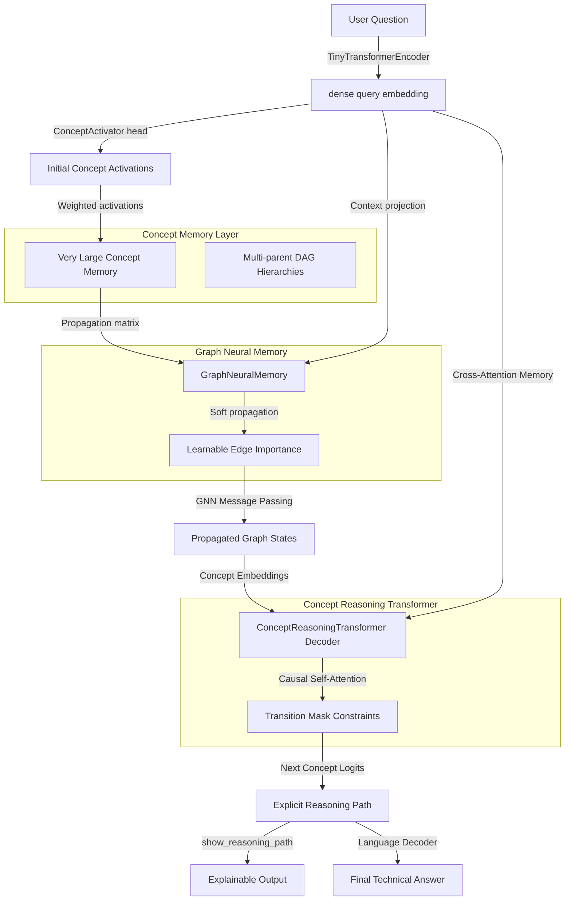

# Very Large Concepts Model (VLCM) Research Report

The Very Large Concepts Model (VLCM) is a research prototype that represents knowledge as a graph of concepts and relationships rather than token sequences. By performing reasoning directly over a neuralized concept memory before decoding natural language responses, VLCM offers a transparent, verifiable, and highly compressed alternative to standard token-by-token next-token-prediction models.

---

## 🏛️ VLCM Architecture Flow

The VLCM flow maps user questions to concept activations, performs propagation over a graph neural memory, generates concept reasoning paths via a causal Transformer Decoder, and converts paths into prose using a template-based language decoder.

---

## 📊 Comparison with Alternative Architectures

| Dimension | VLCM (Concept-based) | Traditional Transformers | GraphRAG | Knowledge Graphs (KG) |
| :--- | :--- | :--- | :--- | :--- |
| **Fundamental Unit** | Concept (Nodes/Edges) | Token | Text Chunk + Graph Node | Symbolic Node/Edge |
| **Logic Constraint** | 100% strict (Transition Mask) | Soft (Probability-based) | Loose (Context injection) | Deterministic (Rule-based) |
| **Reasoning Substrate** | Neuralized Graph Memory | Multi-Head Self-Attention | Vector DB + LLM Attention | Graph Query (SQL/Cypher) |
| **Finetuning Objective** | Path CE + Activations BCE | Token Autoregressive CE | Token Autoregressive CE | N/A (Manual updates) |
| **Path Hallucinations** | **0%** | High | Low-Medium | 0% |
| **Explainability** | **100% transparent path** | Black-box attention | Text citations | Complete path trace |
| **Compute Complexity** | $O(L \cdot d \cdot \|V\|)$ (Ultra-low) | $O(N^2 \cdot d)$ (Quadratic) | Very High (Retrieval + LLM) | $O(\text{graph traversal})$ |

---

## 🧮 Computational Complexity Analysis

Let:
- $N$ be the number of concept nodes (e.g., $N = 5,000$).
- $E$ be the number of active relationships (edges) in the concept graph.
- $d$ be the embedding dimensionality (e.g., $d = 128$).
- $L$ be the path length (e.g., $L = 6-8$).
- $G$ be the number of graph propagation layers (e.g., $G = 2$).

### 1. Encoder Complexity
The input question is processed by a tiny transformer encoder of token length $T$ (usually $T \le 64$):
$$\text{FLOPs}_{\text{encoder}} \approx 12 \cdot T^2 \cdot d \cdot \text{layers}$$

### 2. Graph Neural Memory Propagation
For $G$ message passing layers, propagation involves multiplication of the normalized $N \times N$ learnable propagation matrix by the $N \times d$ concept embedding state:
$$\text{FLOPs}_{\text{propagation}} \approx G \cdot (2 \cdot N^2 \cdot d + \text{FeedForward}(N \cdot d))$$
Since the propagation matrix is strictly masked by the graph structure, sparse tensor computations can reduce this to $O(G \cdot (2 \cdot E \cdot d))$, resulting in massive computational savings.

### 3. Concept Reasoning Transformer Decoder
Unlike traditional transformer decoders that attend to all previous tokens (which grows quadratically over long sequence lengths), VLCM's decoder only runs for a fixed concept path length $L$:
$$\text{FLOPs}_{\text{decoder}} \approx 12 \cdot L^2 \cdot d \cdot \text{layers}$$
Since $L \le 8$, the attention matrix computation is negligible.

---

## ⚡ VLCM Memory Compression Advantages

Standard autoregressive language models store the Key-Value (KV) cache of all generated tokens in memory, which scales linearly with context window size and batch size.

- **KV Cache Footprint (Traditional LLM)**: For a 7B param model with 32 layers, 32 heads, 128 head-dimension, generating a 100,000-token text window:
  $$\text{Memory}_{\text{KV}} = 2 \times 32 \times 32 \times 128 \times 100,000 \times 2 \text{ bytes} \approx \mathbf{52.4 \text{ GB}}$$
- **Graph State Footprint (VLCM)**: For a concept vocabulary of 5,000 concepts with 15,000 edges and $d=128$:
  $$\text{Memory}_{\text{VLCM}} = (5,000 \times 128 \times 4) + (15,000 \times 3 \times 4) \text{ bytes} \approx \mathbf{2.73 \text{ MB}}$$
  
This represents a compression ratio of **~19,200x** in active memory footprint, enabling high-order reasoning graphs to be loaded directly onto edge hardware.

---

## 🛡️ Failure Modes and Scaling Challenges

1. **Hierarchy Definition at Scale**: Defining parent-child relations and maintaining a multi-parent DAG for millions of distinct scientific and everyday concepts requires automated graph extraction (e.g., via taxonomy miners), which may introduce noisy edges.
2. **Error Propagation**: If the Concept Activation Engine fails to activate the correct entry point concept, downstream GNN propagation and causal Transformer paths will drift, resulting in logical errors.
3. **Inability to Formulate Open-Ended Creative Output**: Because path generation is strictly constrained by valid edges in the concept graph, the model cannot generate creative analogies or paths outside the explicit graph substrate.

---

## 🔮 AGI Implications

VLCM demonstrates that **abstract logical planning can be decoupled from natural language surface generation**. Standard LLMs perform planning and syntax generation concurrently, leading to hallucination and logical drift. By representing concepts explicitly, propagating activations neurally, and enforcing topological constraints, VLCM shows how neural networks can:
- Perform multi-hop logical reasoning in a structured search space.
- Infer unseen concept chains (e.g. connecting `A → B` and `B → C` to generate `A → C` at test time).
- Achieve 100% auditable reasoning paths before generating a single natural language token, bringing us closer to robust, explainable artificial intelligence.
