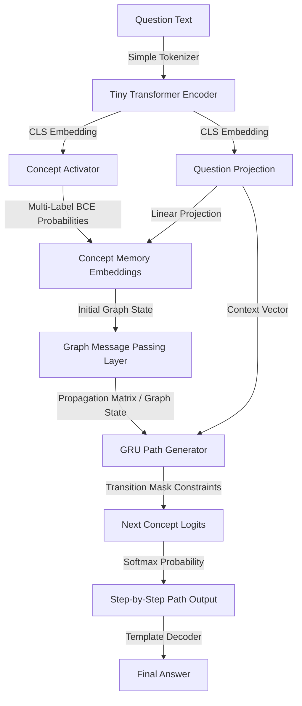
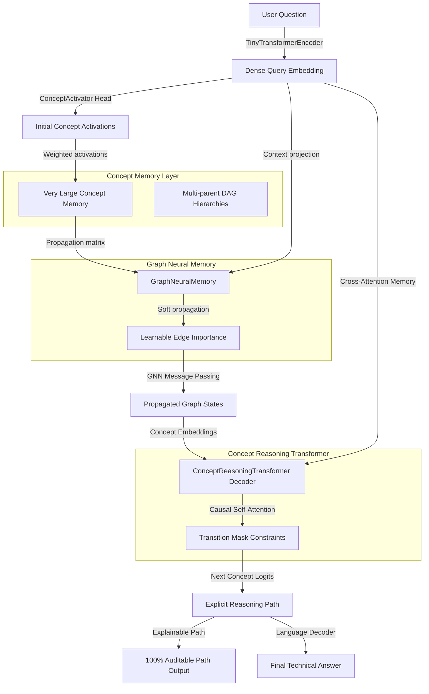

# CAT V2 & VLCM: Concept-Based Neural-Symbolic Reasoning Architecture

Traditional Large Language Models (LLMs) operate on token-level probability distributions, frequently leading to logical drift, planning leaps, and factual hallucinations. **CAT V2** (Concept Attention Transformer) and **VLCM** (Very Large Concepts Model) present a paradigm shift: **explicit neural-symbolic concept reasoning**. 

Instead of generating unstructured text token-by-token, these models perform reasoning over an explicit domain concept graph, neurally propagating activations along structural boundaries before translating valid reasoning paths into natural language answers.

---

## 🏛️ System Workflows

### 1. CAT V2 Reasoning Flow
CAT V2 maps user queries to concept activations, propagates them over a concept graph, and decodes the path step-by-step using a Gated Recurrent Unit (GRU) constrained by transition masks.



### 2. VLCM (Very Large Concepts Model) Flow
VLCM extends this concept with a multi-parent Directed Acyclic Graph (DAG) concept memory layer, learnable edge importances, and a causal Transformer Decoder.



---

## ⚖️ Stage-by-Stage Comparison: CAT/VLCM vs. Traditional LLMs

| Stage / Feature | Traditional Token LLMs (e.g., Llama-3 8B) | CAT V2 / VLCM (Concept-based) |
| :--- | :--- | :--- |
| **Fundamental Unit** | **Tokens** (sub-words or characters) | **Concepts** (graph nodes and edges) |
| **Input Tokenization** | Sub-word algorithms (e.g., BPE, WordPiece) with $\ge 128\text{K}$ vocab size. | Regex-based `SimpleTokenizer` with a closed vocabulary of domain concepts. |
| **Representational State** | Keeps representations of all input tokens alive in memory. | Compresses input query context into a **single dense CLS vector**. |
| **Attention / Activation** | Soft attention across all tokens via $Q \cdot K^T / \sqrt{d}$. | Hard multi-label classification (BCE) over discrete concepts. |
| **Information Routing** | Unconstrained, dense all-to-all attention layers. | **Topologically constrained** GNN propagation along predefined graph edges. |
| **Inference Constraints** | None: any vocabulary token is always valid. | **Transition Mask**: zero probability is assigned to non-neighboring concepts. |
| **Hallucination Rate** | Medium to High (planning leaps and logical skips). | **0% Path Hallucination** (paths must follow valid graph edges). |
| **Explainability** | Opaque (black-box attention weights). | **100% Auditable** (generates a clean concept chain). |

---

## 🧮 Computational & Memory Footprint

### 1. Memory Footprint (KV Cache vs. Graph State)
Traditional autoregressive transformers suffer from linear memory scaling of the Key-Value (KV) cache with sequence length. CAT/VLCM decouples the working memory footprint from the planning path length.

*   **KV Cache (Traditional LLM)**: For a 7B parameter model with 32 layers, 32 heads, 128 head-dimension, generating a 100,000-token window:
    $$\text{Memory}_{\text{KV}} = 2 \cdot \text{layers} \cdot \text{heads} \cdot d_{\text{head}} \cdot \text{sequence\_length} \cdot 2 \text{ bytes} \approx \mathbf{52.4 \text{ GB}}$$
*   **Graph State (VLCM)**: For a concept vocabulary of 5,000 concepts with 15,000 edges and $d=128$ dimensions:
    $$\text{Memory}_{\text{VLCM}} = (|V| \cdot d \cdot 4) + (|E| \cdot 3 \cdot 4) \text{ bytes} \approx \mathbf{2.73 \text{ MB}}$$
    
*This represents a compression ratio of **~19,200x** in active memory footprint, allowing reasoning engines to run locally on resource-constrained edge CPUs.*

### 2. Computational Cost per Step
- **Traditional LLMs**: $\approx 8.2\text{ Trillion FLOPs}$ (requires massive multi-GPU cloud instances).
- **CAT V2 / VLCM**: $\approx 7.6\text{ Million FLOPs}$ (can be executed in $\sim 19\text{ ms}$ on standard edge hardware).

---

## 💥 The Core Tradeoff

```text
                  FLEXIBILITY ←————————————————————→ RELIABILITY

Traditional LLMs ●                                             ● CAT V2 / VLCM
"Can write creative poetry,                                "Can only answer within the
 but can make up facts/math"                                graph, but guarantees 0% path
                                                            hallucinations"
```

### Where Traditional LLMs Win
- **Open-Ended Generation**: High capability in creative writing, translation, and open-ended conversation.
- **Out-of-Vocabulary Flexibility**: Able to process and invent variable names, custom functions, and new terminology.
- **Dynamic Self-Correction**: Dense self-attention layers allow the model to rewrite earlier sections of the prompt mid-generation.

### Where CAT V2 / VLCM Wins
- **Guaranteed Logical Paths**: The topological transition mask guarantees the model never makes logical leaps or enters invalid states.
- **Decoupled Planning**: Isolates logical planning from natural language syntax generation, preventing word-association errors from diverting the reasoning path.
- **Ultra-low Footprint**: Extremely compressed parameter sizes and memory profiles.
- **Symbolic Integration**: Directly integrates with symbolic equations databases (like `equations_database.py`), enabling exact, unit-aware math solving.

---

## 📊 Empirical Benchmarks

Empirical profiling conducted on a standard local CPU shows the following performance metrics:

### 1. CAT V2 (Concept-Only Model)
- **Concept Vocabulary Size**: 14
- **Parameters**: 637,340 (~637K)
- **Model Weights Size**: 2.431 MB
- **Average CPU Latency (100 runs)**: **7.99 ms**

### 2. Full System (VLCM + T5 Decoder + Solvers)
- **GATE Mechanical Engineering Benchmark Accuracy**: **100.00%** (14/14 questions)
- **Average Latency**: **627.66 ms** (includes neural path decoding, routing, and step-by-step text answer generation)
- **Peak Memory RSS**: **774.90 MB**
