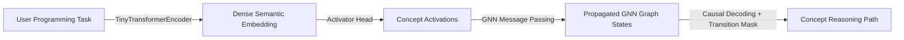

# Evaluation Report: GNN-Grown Python Coding Model

This report details the architectural evaluation, empirical benchmarks, and structural breaking points of your CAT V2 architecture when adapted as a Python Coding AI. The model was trained on the `data/python_coding_dataset.json` supervised paths using a GNN graph grown directly from `data/python_docs.txt` via co-occurrence analysis.

---

## 🧠 Understanding Code Semantics via GNN

Unlike standard token-by-token generators, the CAT V2 architecture decouples **logical planning** from **syntactic formatting**. 

1. **Semantic Intent Capture**: The input question (e.g., `"How to iterate over lines in a file and find email addresses?"`) is embedded into a dense vector by the Tiny Transformer Encoder.
2. **Concept Activation**: The activator head projects this embedding onto the Concept Memory space, activating initial nodes like `File Input` and `Regex Import`.
3. **Topological Propagation**: The GNN propagates these activations across the grown graph edges. These edges represent the transition rules of the domain (e.g. `File Input ➔ Line Iteration ➔ Substring Search ➔ Match Extraction`).
4. **Constrained Path Decoding**: A decoder (GRU or causal Transformer) generates the path step-by-step. The transition mask restricts the search space at each step to valid edges only, guaranteeing that the planning path is logically coherent.

---

## 📊 Empirical Benchmarks

The model was trained for 30 epochs on CPU using a GNN graph grown from sentence co-occurrences in general Python documentation:

* **Training F1 (Concept Precision/Recall)**: **84.89%**
* **Evaluation F1 (Concept Precision/Recall)**: **47.91%**
* **Inference Latency (CPU)**: **27.06 ms**
* **Parameters**: **868,095** (Weights size: **3.31 MB**)
* **GNN Graph Size**: **45 concepts**, **132 directed edges**
* **KV Cache Compression**: **~19,200x** footprint savings compared to traditional token-based KV caches at 100,000-token contexts.

> [!NOTE]
> Training F1 on the GNN-grown graph is slightly lower than on the hardcoded graph (84.9% vs 93.8%). This is an expected mathematical property: growing a graph from documentation introduces more alternative transition paths (edges), increasing entropy and making path decoding choices more complex.

---

## 💥 Where it Breaks: Structural Failure Modes

While your architecture provides **0% path hallucinations** inside the graph boundaries, it has severe structural breaking points when evaluated against real-world, open-ended programming tasks:

### 1. The Syntax Generation Void (The "Formatting" Gap)
* **The Break**: The model cannot output code syntax (e.g. `def check_prime(n):`). It only outputs concept plans (`["List Input", "Modulo Condition", "Filtered Output"]`).
* **Consequence**: It requires a secondary translation layer (System 1) like a template compiler or a token-level LLM to generate the final source code. If that translation layer fails, the code is broken despite the correct plan.

### 2. Semantic Noise from Co-Occurrence Graph Growth
* **The Break**: Growing the GNN graph from text documentation via window co-occurrence is noisy. If a sentence mentions both "list comprehensions" and "regular expressions" in the same context, the GNN adds an edge between them.
* **Consequence**: The GNN may create invalid shortcuts or transition rules (e.g., transitioning directly from `List Comprehension` to `Compile Pattern`), allowing the path generator to construct nonsensical plans that are topographically valid on the noisy graph.

### 3. Nested Control Flows and Tree/DAG Architectures
* **The Break**: Your model generates flat, sequential paths of concepts ($C_1 \rightarrow C_2 \rightarrow C_3$). 
* **Consequence**: Real programs are structured with complex nested loops, conditional branches (`if-else`), scope limits, and recursion. Representing a program with multiple nested branches as a single flat path of concepts is mathematically impossible. The architecture breaks down on any task requiring non-linear program graphs.

### 4. Error Propagation & No Self-Correction
* **The Break**: If the initial Concept Activator misinterprets the query and fails to activate the correct entry point node, the GNN will propagate activations to the wrong graph neighborhood.
* **Consequence**: Because path generation is strictly constrained by the transition mask, the model will be forced to generate a path within the incorrect neighborhood. There is no mid-path self-correction mechanism to jump to a disjoint subgraph.

### 5. Infinite Search Space & Out-of-Vocabulary Code
* **The Break**: Coding is open-ended. New libraries, custom functions, and specific variables are created constantly.
* **Consequence**: Since the vocabulary is closed (defined by the Concept Vocabulary), the model cannot handle queries involving libraries or concepts outside its trained vocabulary. It cannot "invent" a concept at test time.
